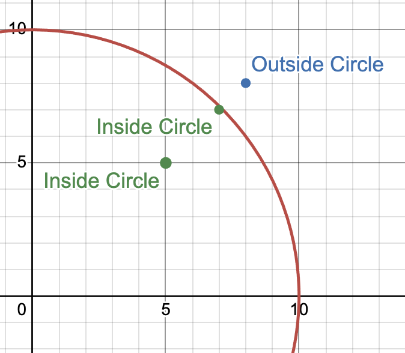

# Monte Carlo Simulation of Pi in Rust

For awhile now, I've wanted to get into Rust and play around with things like its multithreading
features.  So I figured a good way to do that would be to try and compute the value of Pi 
using the Monte Carlo method as fast as possible.  I chose this method because it didn't require
me to find hosting or use external data sources.

If you want to see how this code performs in benchmarking [look over here](benchmarks.md)!

## How it works

This app uses a simplification of the Monte Carlo method by just working with a 
quarter of a circle.  This allows me to keep all integers unsigned which makes the code
easier to work with (and debug).  

This is done by representing the quadrant as a number of points on a cartesian plane plus 1.
So for example, if the number of points is 10  (the default), the possible x and y values range
from 0 to 10 with (0,0) being the center of the circle and (0,10) and (10,0) being the corners
of that square where the edges of the circle touch the edges of the square.

From there, a number of random points (default 100) are generated, each point is evalated to see
if it is in the circle (using the Pythagorean Theorem), and at the end the number of points 
in the circle are divided into the total number of points and multiplied by four.  This gives
us an approximation of Pi.

## CLI Args

The absolute most up to date args can be found by running `monte_carlo -h`, but here's 
a brief introduction to command line options:

- `-g, --grid-size` - How big to make each axis of the grid?  Bigger sizes will yield more precise numbers for Pi.
- `-c, --count` - How many random points to generate in total?
- `-b, --batch-size` - How many random points per loop in each thread?
- `-n, --num-threads` - How many threads to use for random point generation?
- `-m, --metrics` - Set if you want metrics printed out in JSON format.
- `-t, --turbo` - Use "turbo" mode where a simplfied version of the Pythagorean Theorem is used.
- `--cache` - Set to use caching for "is this point inside the circle?" calculations.
- `--benchmark` - Benchmark mode.  This will print how many points per second were plotted.
- `-a, --avg-multiple-runs` - Perform multiple runs and average the values of Pi from all runs.
- `-r, --random-seed` - ADVANCED: Seed the random number generator with a value for deterministic behavior.
  - This is only effective when used in a single thread.  Multiple threads are NOT deterministic because each thread gets its own RNG 

## Architecture

- App - Top level module/struct, that drives everything.  It spawns threads and performs calculations in threads.
- Args - Processes our command-line arguments
- Cache - Stores array of points and whether they are in the circle or not.  This prevents the same calculation from being run on multiple points.
- Grid - Hold size of grid and number of points left to generate - Sits in main thread
- Metrics - Used to hold metrics for our current run such as number of points, time elapsed, etc.
- Point - represents a single point
- Points - represents many points.  Pythagorean Theorem calculations happen here.
- Random - Generates random numbers

## Development

- Test and run
  - `cargo test -- --nocapture && cargo run --`
- Test only
  - `cargo test -- --nocapture`
  - `--nocapture` lets me use `println!()` and similar to write to stdout
- Build for prod
  - `cargo build --release`

